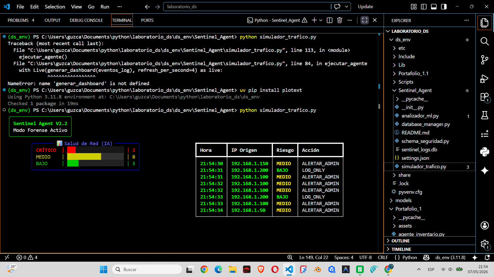
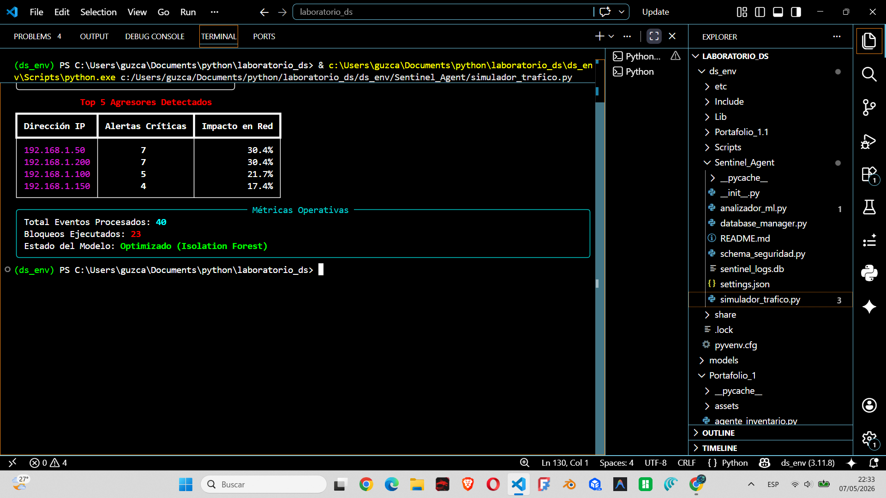

# 🛡️ SentinelAI: MLOps-Driven Network Intrusion Detection System (NIDS)


**SentinelAI** es un ecosistema de ciberseguridad agencial avanzado, diseñado para la detección de amenazas y el análisis forense en tiempo real. Combina un motor de monitoreo de alto rendimiento en terminal con un dashboard web potenciado por IA para proporcionar una capa de defensa proactiva e inteligente.

---

## 🤖 El Agente de Análisis y Decisiones Autónomas

A diferencia de los sistemas NIDS tradicionales que solo registran eventos, **SentinelAI funciona como un Agente Autónomo**. Este componente es el núcleo del sistema y se encarga de:

1.  **Evaluación de Comportamiento (Isolation Forest):** Utiliza aprendizaje no supervisado para detectar desviaciones estadísticas en el tráfico, identificando patrones de ataque antes de que existan firmas conocidas.
2.  **Análisis Forense con LLM (Llama 3):** Interpreta los logs técnicos y genera reportes en lenguaje natural sobre la naturaleza del ataque, el nivel de riesgo y las contramedidas recomendadas.
3.  **Toma de Decisiones en Tiempo Real:** Ejecuta acciones automáticas como el bloqueo de IPs basándose en el riesgo calculado por el motor de ML.

---

## 🚀 Características Principales

### 📡 Sentinel Agent V2.1 (Monitor en Tiempo Real)
Motor de aislamiento activo basado en terminal que procesa telemetría de tráfico en vivo.
- **Motor de Aislamiento Activo**: Detección de desviaciones de protocolo y bloqueo de IP en tiempo real.
- **Analítica de Pareto**: Identificación visual de los agresores de mayor impacto directamente en el CLI.
- **Puntuación de Riesgo Adaptativa**: Distribución de riesgo codificada por colores (CRÍTICO, MEDIO, BAJO).

### 🧠 Dashboard Forense Potenciado por IA
Interfaz de Streamlit de alto contraste para la investigación profunda de incidentes.
- **Consultor Forense LLM**: Potenciado por **Groq Cloud (Llama 3)** para la generación automatizada de reportes de seguridad.
- **Modelado Predictivo**: Integración con **DBSCAN y K-Means** para el agrupamiento de amenazas y predicción de tendencias.
- **Pipeline de Ingesta Global**: Almacenamiento persistente de logs y telemetría vía **Supabase**.

---

## 📸 Technical Showcase

### 1. Sentinel Agent: Live Terminal Monitor
Análisis de tráfico en tiempo real y bloqueo automatizado de anomalías estadísticas.
<p align="center">
  
  
</p>

### 2. Threat Intelligence & Pareto Analysis
Visualización de los "Top Aggressors" y concentración de riesgo mediante gráficos de Pareto.
<p align="center">
  
  
</p>

### 3. AI Forensic Agent (Llama 3)
Análisis forense interactivo utilizando IA Generativa para interpretar patrones de ataque complejos.
<p align="center">
  
  
</p>

### 4. MLOps Status & Model Optimization
Seguimiento en tiempo real del estado del modelo de Isolation Forest y métricas de ejecución.
<p align="center">
  
  
</p>

---

## 🛠️ Arquitectura y Stack

- **Frontend**: Streamlit (Dashboard), Rich/Terminal (Agent).
- **AI/ML**: Scikit-learn (Isolation Forest, DBSCAN, K-Means), Groq Cloud (Llama 3).
- **Backend/Data**: Supabase (PostgreSQL), Python 3.11.
- **DevOps**: Docker, Gestión del ciclo de vida MLOps.

---

## ⚙️ Instalación

1. **Clonar e Instalar**:
   ```bash
   pip install -r requirements.txt
   ```
2. **Configuración del Entorno**:
   Crea un archivo `.env` con tus credenciales:
   ```env
   GROQ_API_KEY=tu_clave
   SUPABASE_URL=tu_url
   SUPABASE_KEY=tu_clave
   ```
3. **Ejecutar el Agente**:
   ```bash
   python simulador_trafico.py
   ```
4. **Iniciar Dashboard**:
   ```bash
   streamlit run app_web.py
   ```

---
*Desarrollado para la defensa proactiva de infraestructuras de red críticas.*
