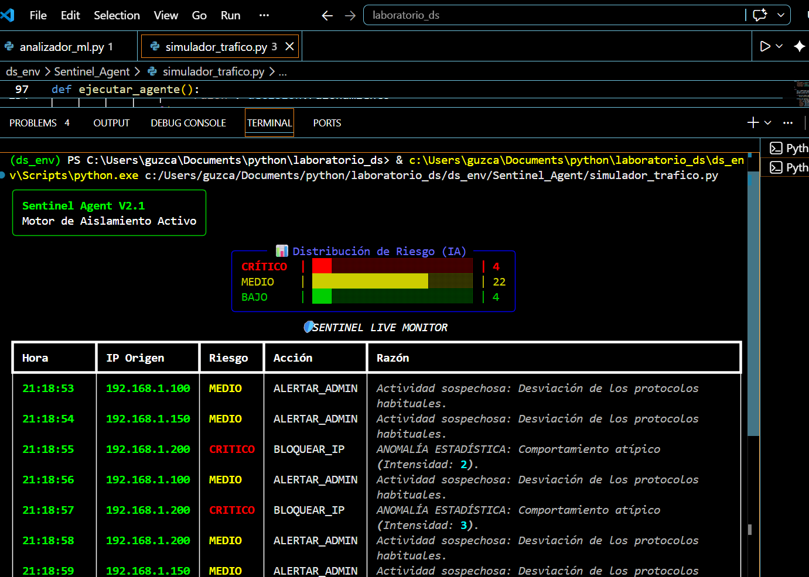
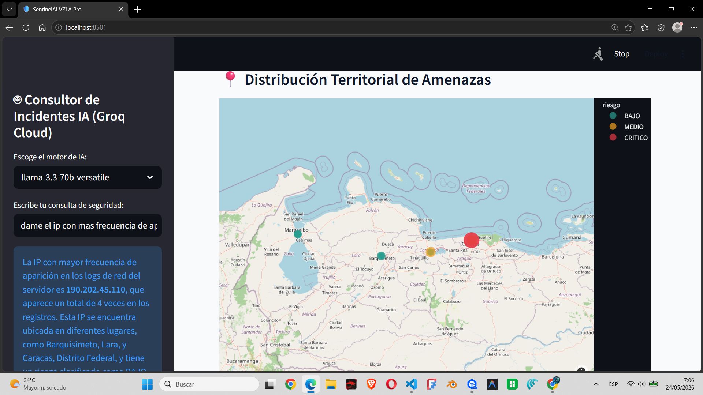
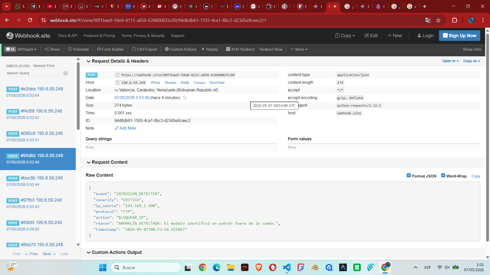
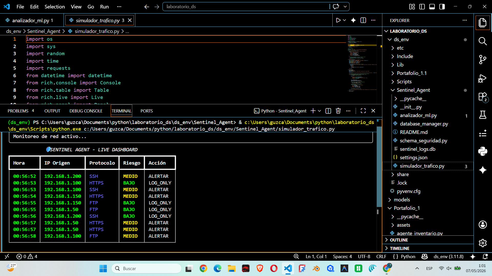
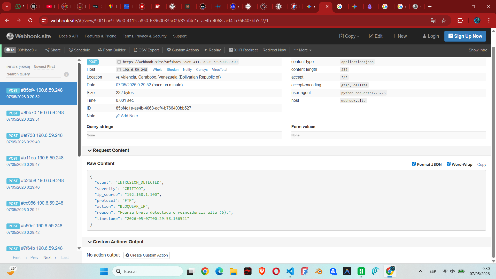
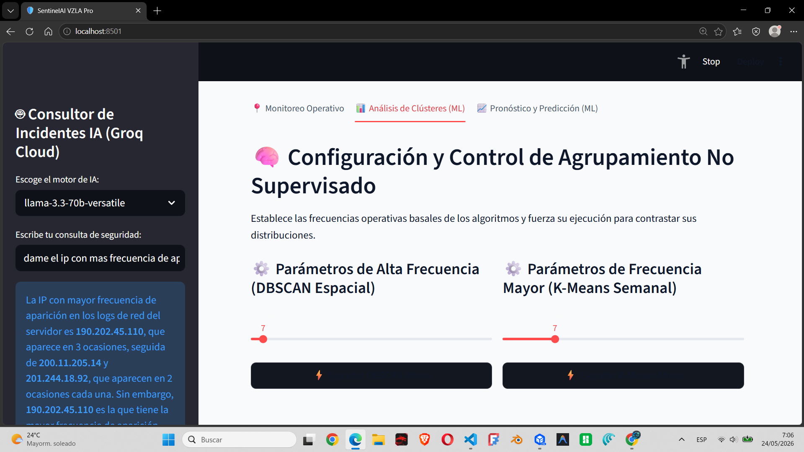

# 🛡️ SentinelAI: MLOps-Driven Network Intrusion Detection System (NIDS)


**SentinelAI** es un ecosistema de ciberseguridad agencial avanzado, diseñado para la detección de amenazas y el análisis forense en tiempo real. Esta rama (`desarrollo-frontend-ml`) representa la **Fase 2** del proyecto.

### 🚀 Ver en Vivo (Demo Operativa)
Puedes probar el modelo y el dashboard agencial en acción aquí:
👉 **[SentinelAI Live Demo](https://sentinelai-nids-lk3vflstx3kc4dr7ujo6sa.streamlit.app/)**

---

## 🤖 Evolución y Capacidades Agenciales (Fase 2)

A diferencia de la versión base, esta evolución introduce capacidades de razonamiento autónomo y visualización de alta densidad:

1.  **Analista Forense IA (Llama 3)**: Integración con **Groq Cloud** para permitir que el sistema explique la naturaleza de los ataques en lenguaje natural.
2.  **Geolocalización de Amenazas**: Visualización en tiempo real de la procedencia de los ataques mediante mapas interactivos de calor.
3.  **Clustering Proactivo (DBSCAN/K-Means)**: Agrupamiento automático de IPs maliciosas para identificar patrones de botnets.
4.  **Predicción de Tráfico (Gradient Boosting)**: Modelos predictivos que alertan sobre posibles picos de intrusión.

---

## 📸 Technical Showcase (Evolución)

### 1. Dashboard de Operaciones Globales
Monitoreo geográfico y métricas críticas de alto contraste.
<p align="center">
  
  
</p>

### 2. Análisis de Inteligencia IA
Interacción con el Consultor Forense para el análisis de incidentes específicos.
<p align="center">
  
  
</p>

### 3. Métricas MLOps y Predicción
Seguimiento del rendimiento de los modelos y pronósticos de vulnerabilidad.
<p align="center">
  
  
</p>

### 4. Prueba de Simulación en Tiempo Real
No necesitas instalar nada para ver el poder del motor de IA. Sigue estos pasos en la demo en vivo:
1.  Accede a la **[Demo en Vivo](https://sentinelai-nids-lk3vflstx3kc4dr7ujo6sa.streamlit.app/)**.
2.  Espera 5 segundos; el sistema inyectará automáticamente telemetría simulada desde los nodos de Venezuela.
3.  Interactúa con el **Consultor de Incidentes IA** en la barra lateral haciendo preguntas como: *"¿Cuál es la IP con más riesgo detectada?"*
4.  Observa cómo los gráficos de **Clustering** y **Predicción** se recalibran automáticamente con cada nuevo evento detectado.

---

## 🛠️ Stack Tecnológico Avanzado

- **Frontend**: Streamlit Pro.
- **AI/ML**: Scikit-learn (Isolation Forest, DBSCAN, K-Means), Groq Cloud (Llama 3.3-70B).
- **Backend/Data**: Supabase (PostgreSQL), Python 3.11.
- **DevOps**: Docker, Gestión de ciclo de vida MLOps.

---

## ⚙️ Instalación (Rama Desarrollo)

1. **Dependencias**:
   ```bash
   pip install -r requirements.txt
   ```
2. **Entorno**:
   Configura tu `.env` con `GROQ_API_KEY`, `SUPABASE_URL` y `SUPABASE_KEY`.
3. **Ejecución**:
   ```bash
   streamlit run app_web.py
   ```

---
*Desarrollado para la defensa proactiva de infraestructuras críticas.*
